# Gallery App

## Оглавление
- [Описание](#описание)
- [Структура и особенности кода](#структура-и-особенности-кода)
- [Скриншоты](#скриншоты)
- [Используемые технологии](#используемые-технологии)
- [Установка](#установка)
- [Портфолио](#портфолио)

## Описание
**Gallery App** — учебное приложение для Android, разработанное в рамках практического задания WebAnt. Оно демонстрирует работу с REST API галереи, позволяет просматривать ленту фотографий, загружать свои изображения и управлять аккаунтом. Интерфейс полностью построен на **Jetpack Compose** и поддерживает светлую/тёмную тему.

### Основные функции
1. Анимированный Splash Screen с логотипом WebAnt.
2. Авторизация и регистрация пользователя с валидацией полей.
3. Поддержка хранения и обновления токенов с помощью `TokenInterceptor` и `TokenAuthenticator`.
4. Лента фотографий с постраничной загрузкой через **Paging** и поиском по названию.
5. Загрузка изображения из памяти устройства через `galleryLauncher` и отправка на сервер.
6. Просмотр и редактирование данных фотографии.
7. Раздел «Профиль» со сменой пароля и настройками.

## Структура и особенности кода
Проект использует паттерн **MVI**. Каждая функциональность оформлена отдельным пакетом (`auth`, `home`, `add_photo`, `profile`, `onboarding`) с подпакетами `data`, `domain` и `presentation` по чистой архитектуре.

- **Навигация** построена через `Navigation Compose` и типобезопасные маршруты. Состояния экранов описаны как сериализуемые sealed классы в [`Screens`](app/src/main/java/bob/colbaskin/webantpractice/navigation/Screens.kt), графы объявлены в [`Graphs`](app/src/main/java/bob/colbaskin/webantpractice/navigation/Graphs.kt), а переходы выполняются с помощью расширения [`animatedTransition`](app/src/main/java/bob/colbaskin/webantpractice/navigation/animatedTransition.kt).
- **Данные пользователя** хранятся в `DataStore` с `ProtoBuf` ([`UserDataStore`](app/src/main/java/bob/colbaskin/webantpractice/common/user_prefs/data/local/datastore/UserDataSore.kt)), что обеспечивает type‑safe сохранение статуса онбординга и авторизации.
- **DI** реализовано через **Hilt**. Модули располагаются в пакете [`di`](app/src/main/java/bob/colbaskin/webantpractice/di) и предоставляют `Retrofit`, `OkHttpClient` с перехватчиками токенов и репозитории для работы с API.
- **Дизайн‑система** включает собственную тему [`WebAntPracticeTheme`](app/src/main/java/bob/colbaskin/webantpractice/common/design_system/theme/Theme.kt), палитру цветов, шейпы и типографику. Все компоненты интерфейса из [UiKit'а](https://www.figma.com/design/90x9N8TsvSJLx9eecN2zGr/iOS-Тестовое-Gallery?node-id=12685-2013&p=f&t=Ib96xtaazHErKtDj-0) (`AppBars`, `Buttons`, `CustomTextField` и др. также необходимые по макету)  переиспользуются во всех экранах.
- Все строки и ресурсы вынесены в [`strings.xml`](app/src/main/res/values/strings.xml) и обращение к ним происходит через `R.string.*`, что упрощает локализацию.
- Для загрузки изображений используется **Coil**, а сетевые запросы выполняются через **Retrofit** с логированием и хранением cookies.
- **Secrets Plugin** используется для сокрытия конфиденциальной информации в `local.properties`. Для запуска будет необходимо указать нужные данные: `BASE_API_URL`, `CLIENT_ID` и `CLIENT_SECRET`.
Пример файла `local.properties`, если захотите скачать и запустить проект:
```properties
    sdk.dir=...
    BASE_API_URL=https://example.api/
    CLIENT_ID=...
    CLIENT_SECRET=...
```

## Скриншоты
<p align="center">
  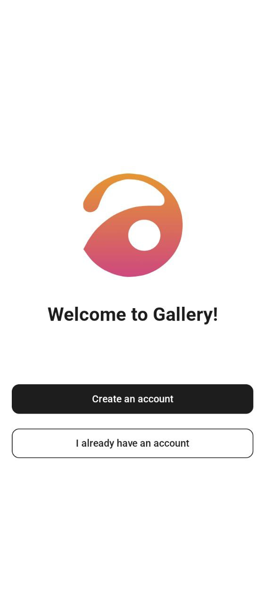
  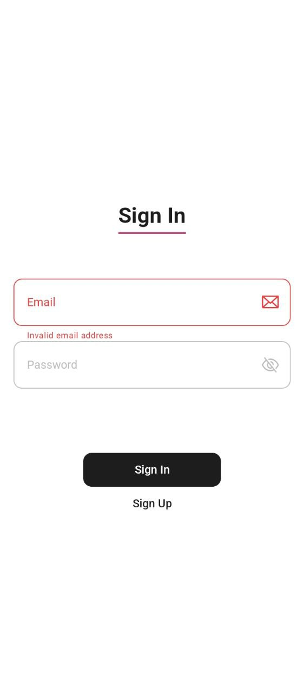
  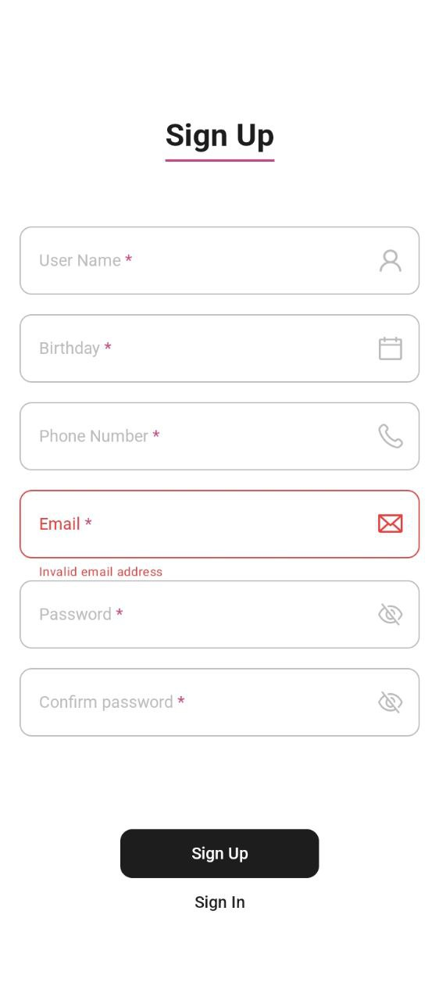
  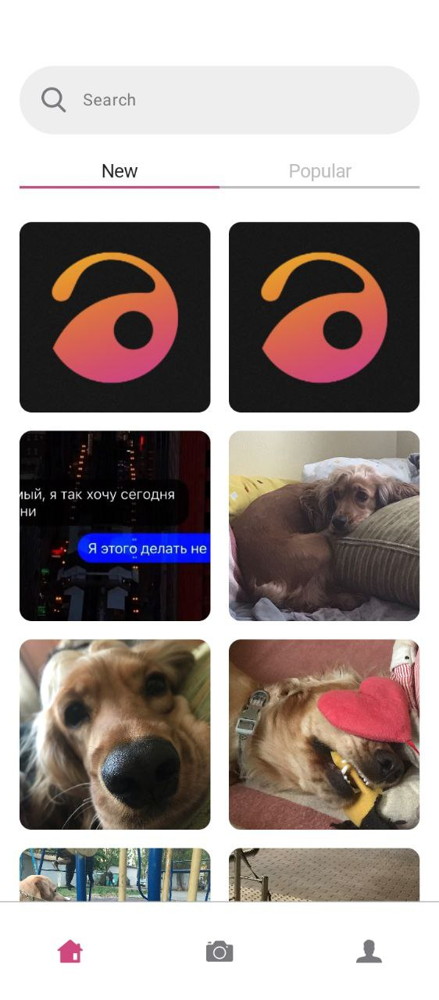
  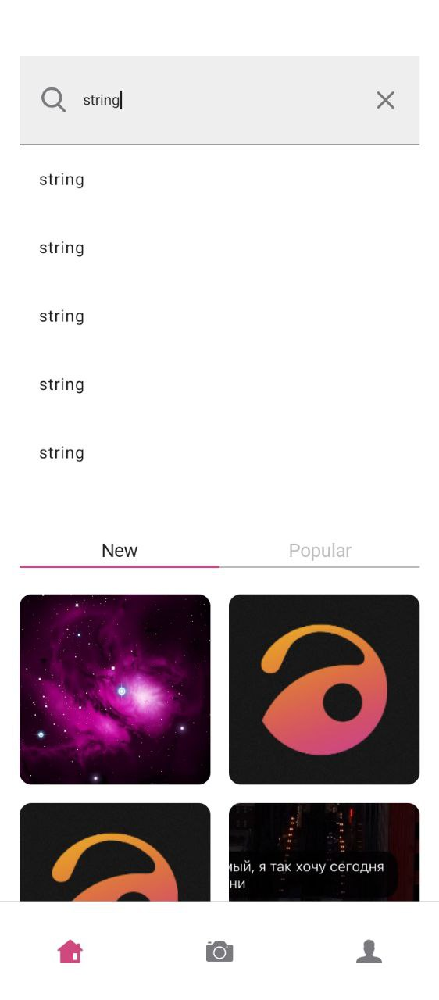
  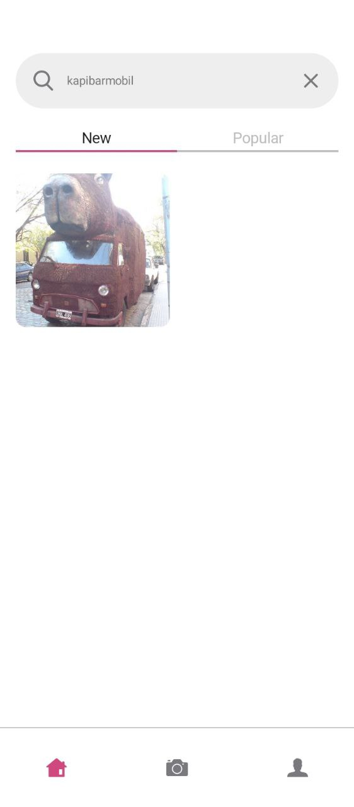
  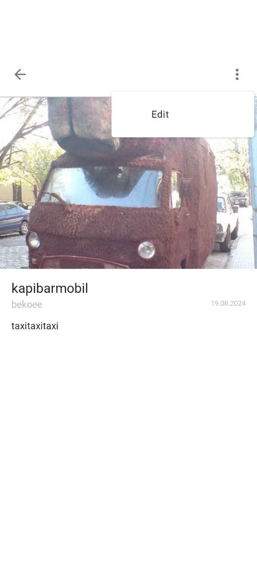
  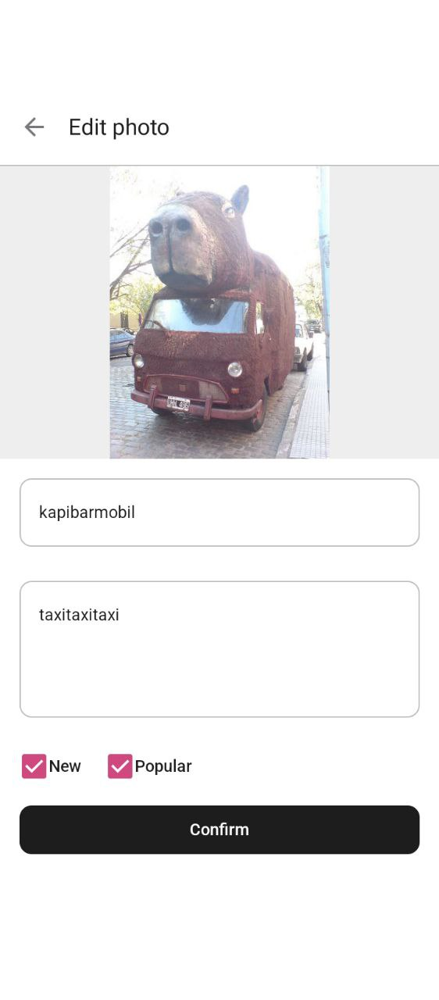
  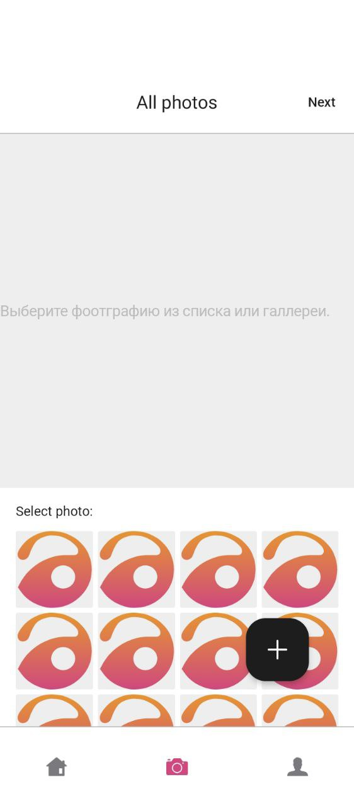
  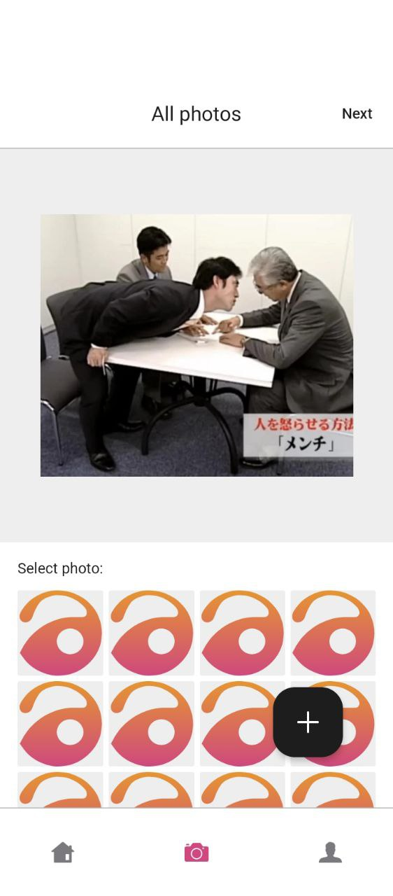
  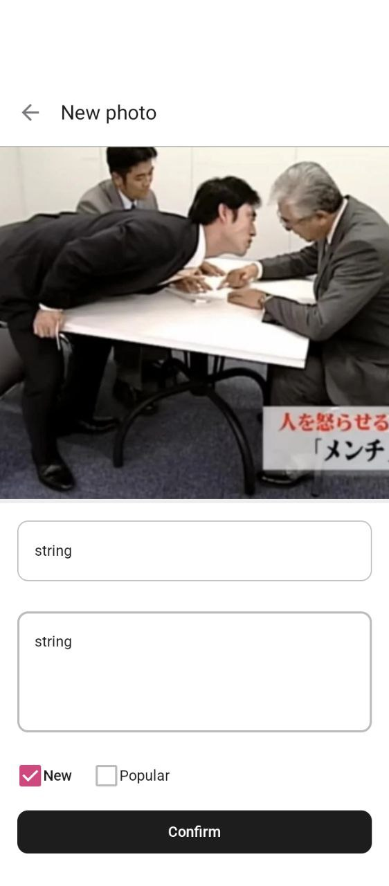
  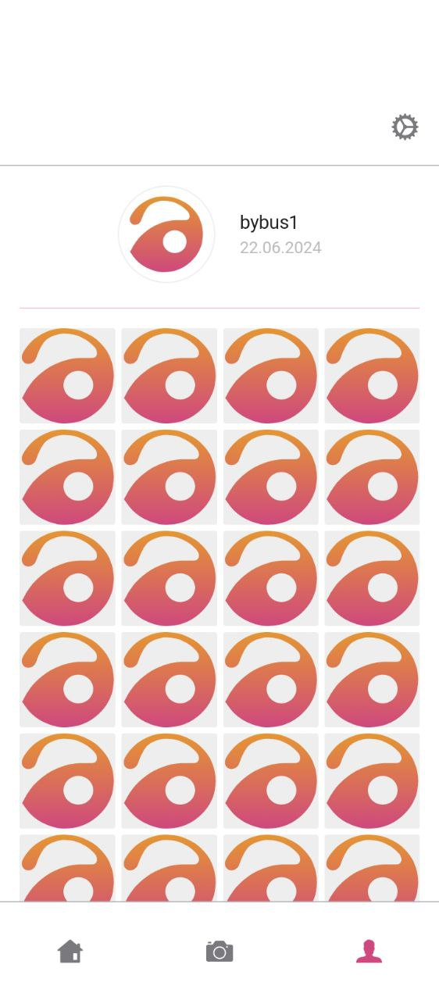
  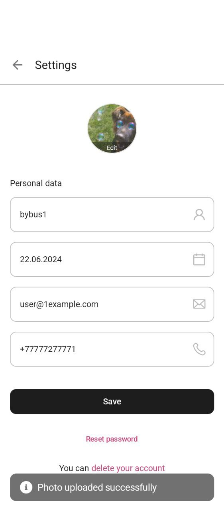
  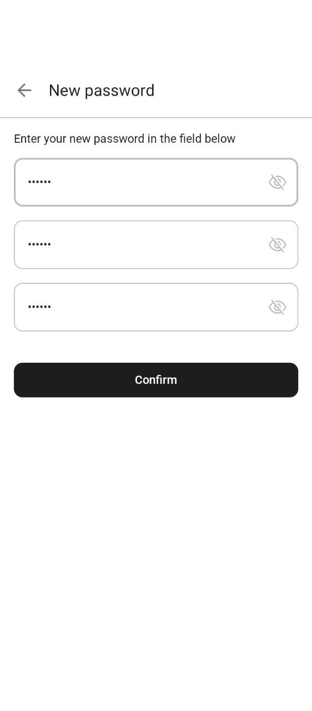
  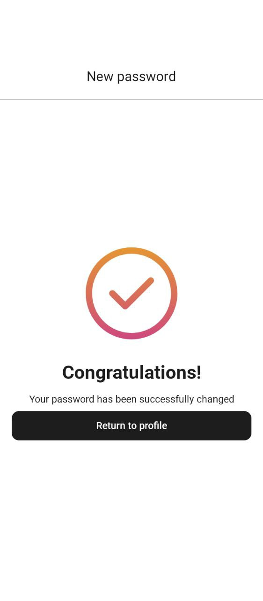
</p>

## Используемые технологии
| Технология                    | Описание                                                       |
|-------------------------------|----------------------------------------------------------------|
| **Jetpack Compose**           | Построение пользовательского интерфейса и навигации            |
| **Hilt**                      | Внедрение зависимостей                                         |
| **Retrofit + OkHttp**         | Работа с HTTP API и перехват запросов                          |
| **DataStore (ProtoBuf)**      | Хранение настроек и токенов пользователя                       |
| **Paging**                    | Постраничная подгрузка списка фотографий                       |
| **Kotlinx Serialization**     | Сериализация аргументов для type‑safe навигации + API запросов |
| **Coil**                      | Загрузка изображений                                           |
| **Secrets Plugin**            | Сокрытие конфиденциальной информации                           |

## Установка

<p align="center">Ссылка на текущую версию <a href="https://github.com/bybuss/WebAntPractice/releases/tag/v1.0.0">Releases</a></p>
<p align="center"><a href="https://github.com/user-attachments/files/20852622/apk.zip">Прямая ссылка на установку .zip</a></p>
<p align="center"><a href="https://github.com/bybuss/WebAntPractice/blob/main/app/release/app-release.apk">Прямая ссылка на установку .apk</a></p>


## Портфолио
Для ознакомления с другими работами автора вы можете посетить портфолио на [Behance](https://www.behance.net/gallery/222004489/Android-Developer-Portfolio).